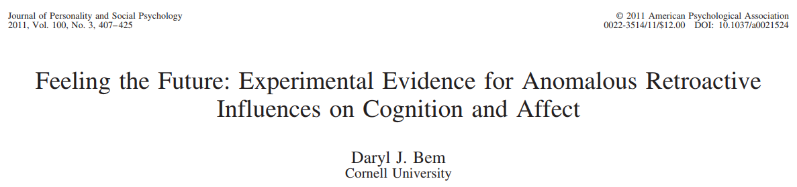
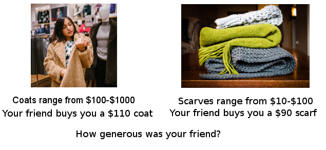
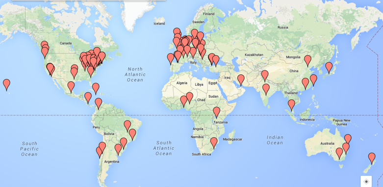
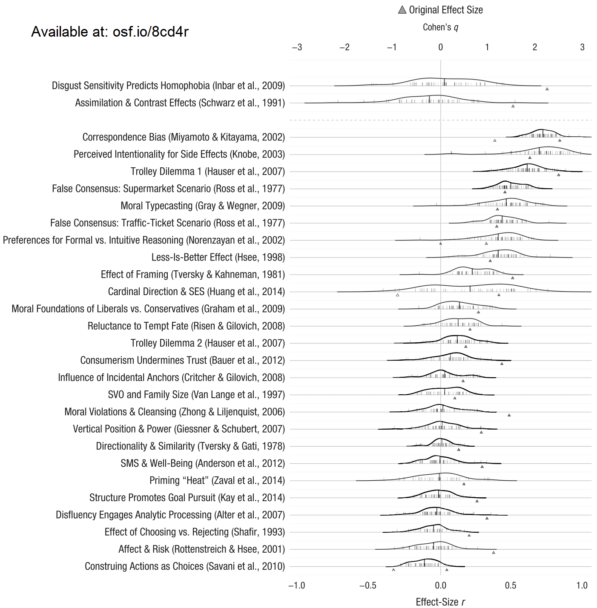
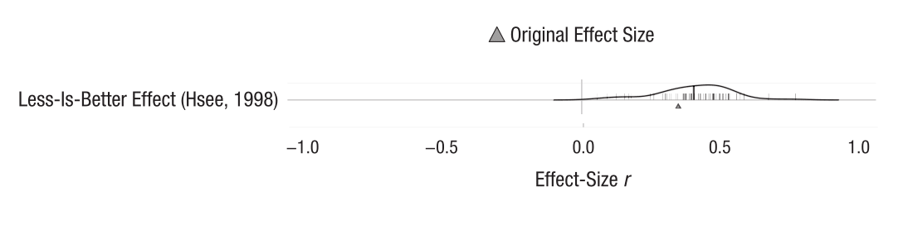
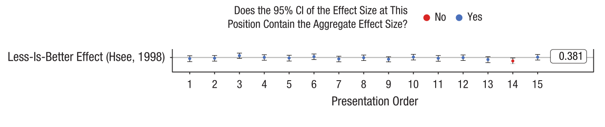
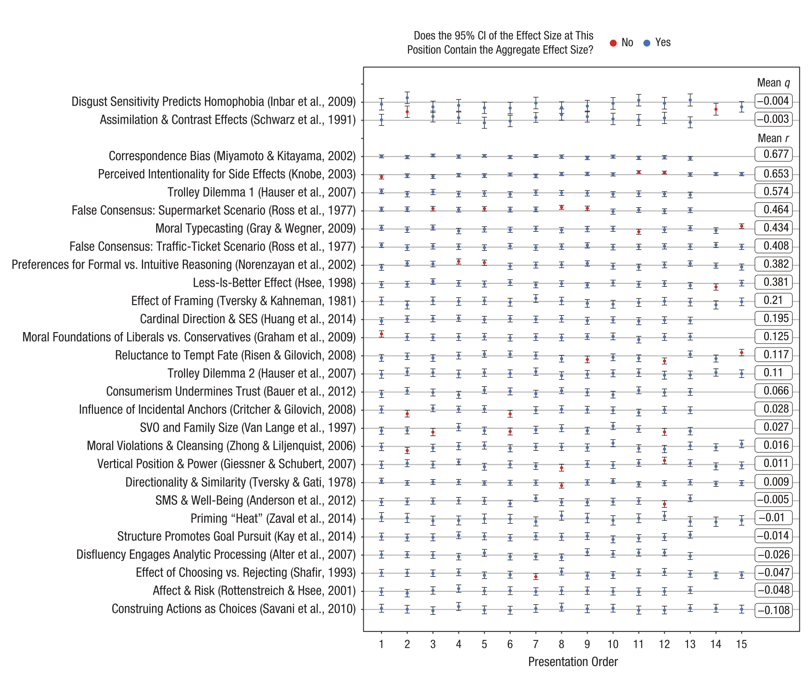
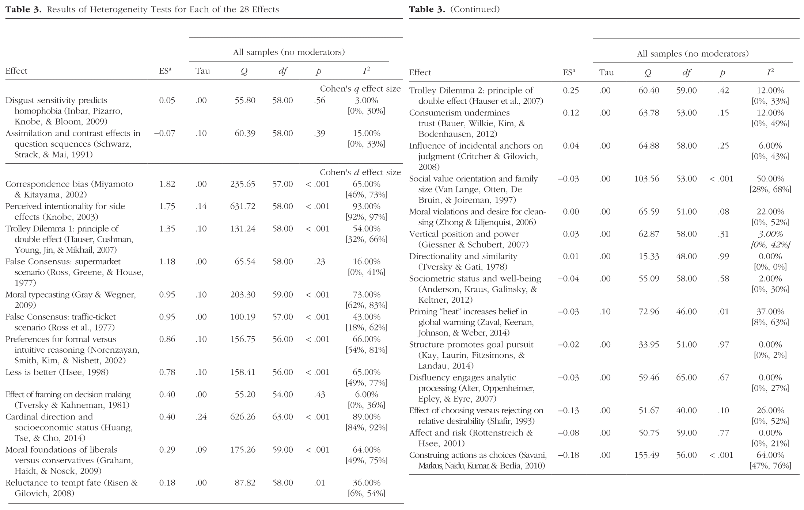
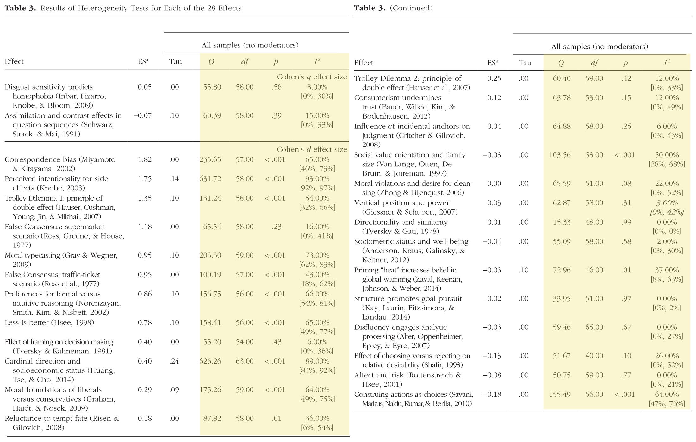
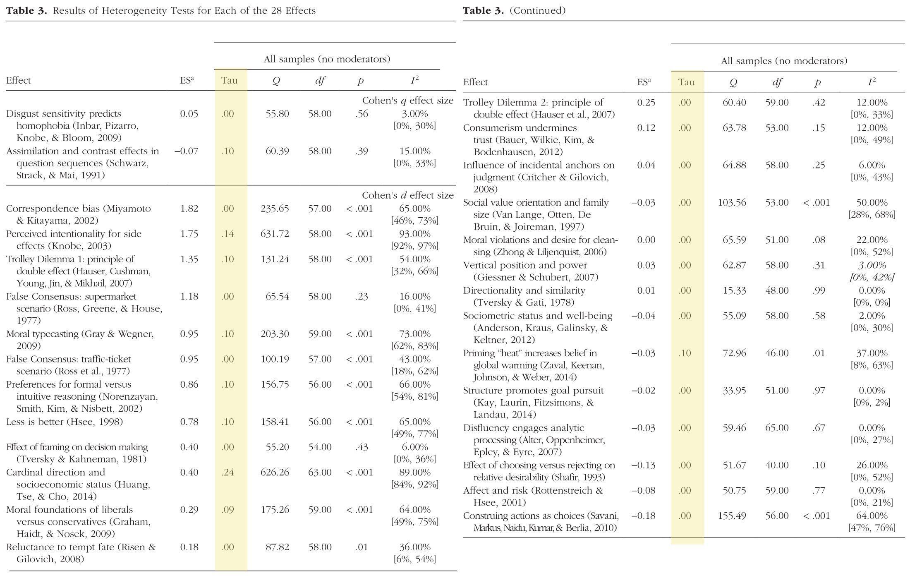

```{r setup, include=FALSE}
options(htmltools.dir.version = FALSE)
```

class: center, middle

# Many Labs 2

---

# Replication Crisis

--

### From cause for concern...

--

.left[]


.center[]


.right[]

---

# Replication Crisis

### ...to evidence of a problem...

- `Reproducibility Project: Psychology` <small>(OSC, 2015)</small>  
  - ~40/100 studies replicated
- `Social Sciences Replication Project` <small>(Camerer et al., 2018)</small>
  - 13/21 replicated
- `Multiple large-scale Registered Reports`

---

# Replication Crisis

### ...to addressing the problem

--

- <b>What we know:
  - </b> It's easy to fool yourself with data (<i>p</i> < .05).
--

  - <i>p</i> values =/= truth.
--

- <b>What we want to know:</b>
  - How to ensure our own results are replicable.
--

- <b>What we don't know:</b>
  - Very much about replication.
--

  - Must improve understanding to inform solutions
---

# Many Labs Projects

Large collaborations of researchers replicating the same findings. Each project examines a different aspect of replication.

---

background-image: url(images/ml1.png)
background-size: 400px
background-position: 90% 45%

# Many Labs Projects

Large collaborations of researchers replicating the same findings. Each project examines a different aspect of replication. 

- `Many Labs 1` <small>(Klein et al., 2014)</small>  
  - 36 labs
  - 10/13 successful replications
  - Little variation between samples
--

- `Many Labs 2` <small>(Klein et al., in press)</small>
  - Discussing today
--

- `Many Labs 3` <small>(Ebersole et al., 2016)</small>
  - 3/10 successful replications
  - Little variation across semester
--

- `Many Labs 4` <small>(Klein et al., in prep)</small>
  - Terror Management Theory-specific
  - Compare expert replications vs "in-house" replications
--

- `Many Labs 5` <small>(Ebersole et al., in prep)</small>
  - Follow-up to Reproducibility Project
--

- Also: `Many Beds` <small>(IJzerman et al.,)</small>, `Many Babies`, `Many Analysts`, `Many Labs VR`, `Many Numbers`, `Brazilian Reproducibility Project`
---

# Many Labs 2

--

Like Many Labs 1, but a much stronger test:
--

- <b>Question:</b> Will psychology studies replicate when they're repeated in contexts and samples very different from the original?
--

- <b>Goal: </b>Replicate many different studies all around the world and compare if they vary based on the sample of data collection.
--

- Replicated 28 studies
  - Selected for impact, diversity of content, possibility for variation
  - Split across two study "packages" due to length
  - Computerized in Qualtrics
  - Randomized study order, presented back-to-back
---

# Many Labs 2 Hsee example

.center[]

---

# Many Labs 2

Like Many Labs 1, but a much stronger test:

- <b>Question:</b> Will psychology studies replicate when they're repeated in contexts and samples very different from the original?
- <b>Goal: </b>Replicate many different studies all around the world and compare if they vary based on the sample of data collection.
- Replicated 28 studies
  - Selected for impact, diversity of content, possibility for variation
  - Split across two study "packages" due to length
  - Computerized in Qualtrics
  - Randomized study order, presented back-to-back
--

- Administer identical study package across as many diverse samples as possible
---

# Many Labs 1 Map

.center[]

---

# Many Labs 2 Map

.center[]

---

# Many Labs 2

- 125 samples (each study administered in 60+)
- 36 countries, translated into 16 languages
- 15,305 participants total
  
---

.center[]

---

# Many Labs 2 Results

--
- 14/28 successful replications
  - <i>p</i> < .0001, non-trivial effect size, same direction as original
  - One additional weakly supported: <i>p</i> = .03

--
- 21/28 had smaller effect size than original
  - Median original <i>d</i> = 0.60
  - Median replication <i>d</i> = 0.15

---

# Many Labs 2 Heterogeneity

.center[]

--
- Q statistic: 11/28 had <i>p</i> < .001 (statistically significant heterogeneity)
  - For 11 studies, observed variability across sites exceeded that which would be expected due to chance.

--
- However: 26/28 Tau ≤ 0.1
  - Variability across sites <i>existed</i>, but only had a very small effect (except for 1 or 2 studies)

---

# Discussion

--
- Low variation across sample/context

--
  - Not reasonable to discount replications <i>by default</i> based on sample

--
  - Instead, test moderators empirically

--
- Replication rate aligns with other projects
  - Is this meaningful?

--
- Many studies replicate robustly (and robust replicability is a feasible goal)

--
  - Reinforces need for solutions to ensure replicability

--
- Open data: [https://osf.io/8cd4r/](https://osf.io/8cd4r/)
  - CC0, free use (any purpose)
  - We barely scratched surface

---

class: center, middle

# Thanks!

Special thanks to co-leads Fred Hasselman, Michelangelo Vianello, and Brian Nosek + 186 other co-authors.
  
Questions/comments?

<br>
<br>
<br>
@raklein3 <br>
raklein22@gmail.com <br>
https://www.raklein.me 

<br>
<br>

&nbsp;&nbsp;&nbsp;&nbsp;&nbsp;&nbsp;

---

.center[]

---

.center[]

---

.center[]

---

.center[]

---

.center[]